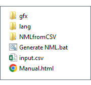
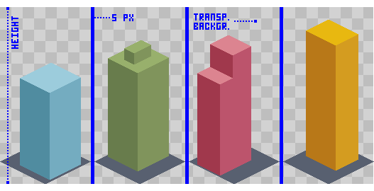
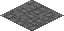
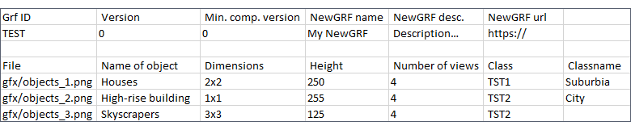
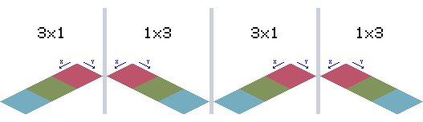
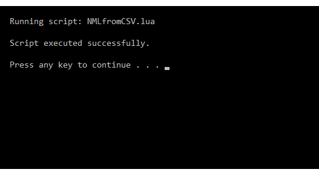

# NMLfromCSV (in Lua)

**NMLfromCSV** is a straightforward scripting tool that converts basic input from a CSV file into NML code for an **Object NewGRF**, ready to be compiled.

It’s intended for users with little or no experience in NML or coding, so the provided templates offer only basic functionality (though the catalog can be easily extended thanks to the script’s modularity).

The tool is distributed with precompiled Lua binaries, so no installation or additional setup is required.

## Step 1: Directory structure

Extract the contents of _NMLfromCSV.zip_ into the **root folder** of your NewGRF project.

The subfolders `gfx` and `lang` are going to be a part of the NewGRF and are required during compilation.<br>
The `NMLfromCSV` folder contains files used by the script. You can ignore it unless you want to modify _settings.txt_ or edit a template.

After extraction, your folder should look like this:




## Step 2: Sprites

Add your sprites to the **gfx** folder. The images must follow these rules:

1. Image format: **.png**
2. Color depth: **32 bpp** (RGBA, i.e. with _transparent background_)
3. Space between views: **5 px** (_the sprite order determines the view order!_)
4. <span id="sprite">Heights</span> can differ between PNGs (but must be correctly specified in _input.csv_)

Example of a valid 4-view sprite:




<u>**TODO**</u>: The **gfx** folder contains a file named _ground.png_.



<u>_For now, it is used as a ground tile under objects by default (assuming the objects have their own ground) until proper ground options are implemented._</u>


## Step 3: input.csv

The **input.csv** file is where you define the NML output. It has **two sections**.

Here’s how the content might look:



Or in plain text:

```
Grf ID, Version, Min. comp. version, NewGRF name, NewGRF desc., NewGRF url
TEST, 0, 0, My NewGRF, Description…, https://

File, Name of object, Dimensions, Height, Number of views, Class, Classname
gfx/objects_1.png, Houses, 2x2, 250, 4, TST1, Suburbia
gfx/objects_2.png, High-rise building, 1x1, 255, 4, TST2, City
gfx/objects_3.png, Skyscrapers, 3x3, 125, 4, TST2
```

### First section

The first part defines the **GRF block**.<br>
You should know at least a little bit what you're doing here, so I highly recommend to read this part of **NML Tutorial:** [Starting an NML file](https://www.tt-wiki.net/wiki/NMLTutorial/Starting_an_NML_file).

But a quick explanation:

<u>**Grf ID**</u><br>
GRFID is a four-byte string that needs to be unique. If two NewGRFs share the same GRFID,  only one can be loaded.<br>
Some examples of correct GRFID (backslash indicates that the next two characters make one byte, i.e. two _hexadecimal_ digits):

`SF\01\01`, `HTT\01`, `OTTD`

More details: [TT-wiki: Grfid](https://www.tt-wiki.net/wiki/NMLTutorial/Starting_an_NML_file#:~:text=grf%20%7B-,Line%202%3A%20grfid%3A%20%3Cliteral%2Dstring%3E%3B,-This%20defines%20the)

<u>**Version**</u><br>
The current version of your NewGRF. Increase it with each update.

<u>**Min. comp. version**</u><br>
Minimum compatible version. Set it to the current version whenever backward compatibility is broken (see above).

<u>**NewGRF name**</u><br>
The name that will be displayed in the NewGRF list in the main menu.

<u>**NewGRF desc.**</u><br>
The description that will be displayed in the NewGRF list in the main menu.

<u>**NewGRF url**</u><br>
Optional, but useful.<br>
Usually a link to a site on Github or TT-forums where you post your project's files.


### Second section

This is where you define the objects.

> The order of entries in this section determines the order of objects in the resulting NewGRF!

<u>**File**</u><br>
Filename of the sprite PNG. Including the _gfx/_ part is optional; it's just for clarity. The script assumes all sprites are in the `gfx` folder.

<u>**Name of object**</u><br>
The display name shown in the in-game purchase menu. Can be seen later in the language file (see Step 5)

<u>**Dimensions**</u><br>
This is a key parameter, because the script uses it to choose the right template.<br>
Here is how OpenTTD's coordinate system works, shown with a 3x1 object:



> <u>Important</u>: Notice how the four views are mirrored. Keep that in mind when preparing your sprites.<br>
> Also, the order of views is hardcoded to start with 3x1, 2x1, etc. (not 1x3, 1x2).


<u>**Height**</u><br>
The height of the PNG file, not the object itself - see Step 2.<br>
If you get an nmlc error like this:

```
nmlc ERROR: "NMLfromCSV.nml", Read beyond bounds of image file
```

Then you've likely used an incorrect height in _input.csv_.

<u>**Number of views**</u><br>
The number of views ("options") for the object. 

<u>**Class**</u><br>
String literal of length 4 (allowed characters are A-Z, 0-9).<br>
Defines a category in the in-game objects menu.<br>
Objects with the **same class** will be **grouped together** in the menu (even across different NewGRFs).

<u>**Classname**</u><br>
The actual name of a class that will be displayed in the objects menu.<br>
Doesn't have to be on each line of _input.csv_, but **has to be assigned to at least the first occurrence** of a class (see example above in Step 3).<br>
Category names can be seen later in the language file (see Step 5)


## Step 4: Generate NML.bat

Once your sprites and _input.csv_ are ready, double-click ***Generate NML.bat*** to run the script.

If successful, you'll see a window like this:



This means two new files were generated:<br>

- `NMLfromCSV.nml`<br>
- `english.lng` in the subfolder `lang`.

Before you start compiling the NML code, you can still make changes to strings in _english.lng_.


## Step 5: Language file (optional)

In the subfolder `lang`, the script generated a language file named _english.lng_. It contains all strings related to your NewGRF and its objects.<br>
If you filled in _input.csv_ properly, you won't likely need to change anything.<br>
However, you can still tweak things here before the final step: compilation.


## Step 6: Compilation

You're now ready to compile the NML code into a `.grf` file.<br>
If you’re unsure how to do that, follow the instructions here:

**NML Tutorial:** [NML Compiler](https://www.tt-wiki.net/wiki/NMLTutorial/Installation).


## Settings file

If you feel adventurous, you can check out the **settings.txt** file in the _NMLfromCSV_ directory and play with the options.

For example, you may want to change the separator used in _input.csv_, if any of your strings contain a comma (e.g. NewGRF description).<br>
In that case, you can use a semicolon as a separator:

**input.csv**:
```
Grf ID; Version; Min. comp. version; NewGRF name; NewGRF desc.; NewGRF url
TEST; 0; 0; My NewGRF; Houses, skyscrapers as objects.; https://
```

And change the settings accordingly in<br>
**settings.txt**:
```
separator=;
```
